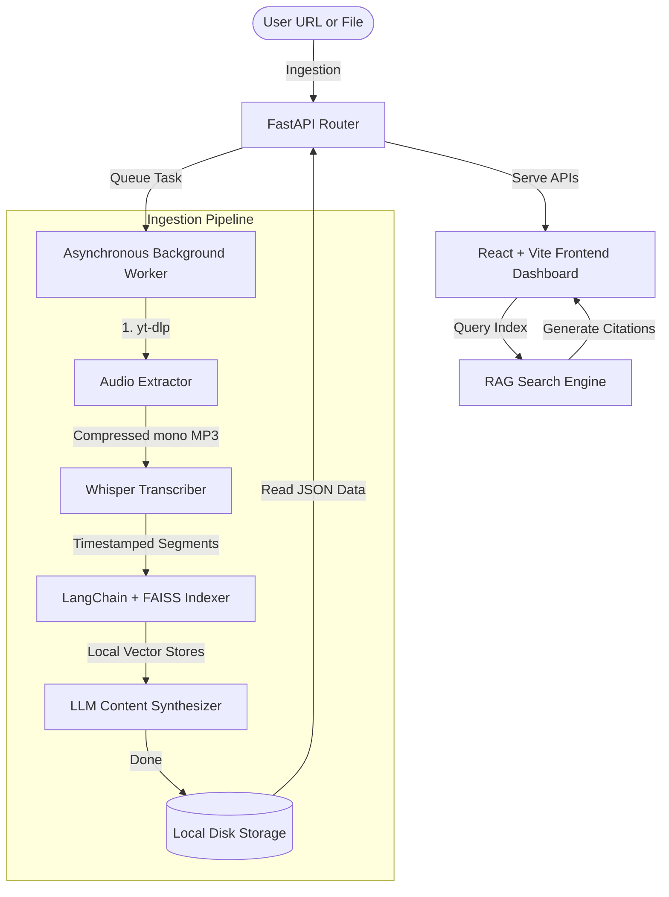

# PodcastIQ — YouTube & Podcast Intelligence Layer

PodcastIQ is an AI-powered intelligence platform that unlocks high-value knowledge trapped inside long-form audio and video podcasts. Paste any public YouTube URL or upload an audio file to receive interactive transcripts, ask natural language questions with clickable timestamp citations, navigate through an interactive timeline, and auto-generate structured show notes, quotes, and social media drafts.

---

## 🚀 Key Features

*   **Ingestion Pipeline:** Auto-extracts audio streams using `yt-dlp` and converts them to lightweight speech-optimized MP3 streams.
*   **Timestamped Transcription:** Generates high-fidelity transcripts with precise segment timestamps using local Whisper or cloud-based transcriptions APIs (OpenAI/Groq).
*   **Dynamic Scrubber Timeline:** An interactive chronological feed showing text segments. Click any segment to focus or scroll.
*   **Clickable Citation RAG Chat:** Chat with the episode's content using a local FAISS vector store. The assistant cites its answers with clickable timestamp chips (e.g. `[12:45]`) that instantly focus the timeline view.
*   **Auto-Generated Deliverables Kit:**
    *   **Show Notes:** Formatted Markdown outlines with timeline highlights.
    *   **Key Quotes:** Notable guest quotes inside blockquotes with direct timestamps.
    *   **Social Kit:** PLATFORM-TAILORED copy drafts prepared for Twitter (threads), LinkedIn (insights-driven), and Instagram (hooks + hashtags).

---

## 🛠️ Technology Stack

*   **Frontend:** React + Vite + Tailwind CSS v4 + Lucide Icons + React Router
*   **Backend:** FastAPI (Python) + Pydantic validation + Asynchronous Background Tasks
*   **AI/RAG:** LangChain orchestration + FAISS vector search + local `sentence-transformers` embeddings (MiniLM)
*   **LLMs:** Support for **Groq** (Llama-3 models) and **OpenAI** (GPT-3.5-turbo / GPT-4)
*   **Audio Pipeline:** `yt-dlp` stream extraction + `ffmpeg` encoding

---

## 📐 System Architecture



---

## 📦 Installation & Setup

### Prerequisites
*   Python 3.8+ installed
*   Node.js 18+ installed
*   `ffmpeg` system binary installed (Required for Whisper and yt-dlp to convert audio streams).
    *   *Windows:* Install via `scoop install ffmpeg` or `choco install ffmpeg`.
    *   *Mac:* Install via `brew install ffmpeg`.

### 1. Backend Configuration
1.  Navigate into the `backend/` directory:
    ```bash
    cd backend
    ```
2.  Create and activate a virtual environment:
    ```bash
    python -m venv .venv
    # Windows:
    .venv\Scripts\activate
    # Mac/Linux:
    source .venv/bin/activate
    ```
3.  Install dependencies:
    ```bash
    pip install -r requirements.txt
    ```
4.  Copy `.env.example` as `.env` and fill in your API keys (e.g. `GROQ_API_KEY` or `OPENAI_API_KEY`):
    ```bash
    cp .env.example .env
    ```
5.  Start the local server:
    ```bash
    python -m uvicorn app.main:app --port 8000 --reload
    ```

### 2. Frontend Configuration
1.  Navigate into the `frontend/` directory:
    ```bash
    cd ../frontend
    ```
2.  Install packages:
    ```bash
    npm install
    ```
3.  Start the development server:
    ```bash
    npm run dev
    ```
4.  Open `http://localhost:5173` in your browser.

---

## ⚙️ Environment Configuration (`.env`)

PodcastIQ is designed to run completely free locally or with blazingly fast API clouds. Here are the core settings:

```ini
# Environment
ENV=development
PORT=8000

# LLM Providers (Configure at least one)
GROQ_API_KEY=gsk_your_groq_api_key_here
OPENAI_API_KEY=sk-proj-your_openai_api_key_here

# Selected Active LLM Models
LLM_PROVIDER=groq # groq | openai
LLM_MODEL=llama3-8b-8192 # groq: llama3-8b-8192 or openai: gpt-3.5-turbo

# Transcription Configurations
WHISPER_MODE=local # local (runs whisper on CPU/GPU) | api (dispatches requests)
WHISPER_LOCAL_MODEL=base # tiny | base | small | medium
WHISPER_API_PROVIDER=openai # openai | groq
```

---

## 📡 API Endpoints

*   `POST /api/process`: Ingests a YouTube URL and schedules background tasks.
    ```json
    {
      "youtube_url": "https://www.youtube.com/watch?v=dQw4w9WgXcQ",
      "custom_title": "Optional Title"
    }
    ```
*   `GET /api/job/{job_id}`: Polls the active status (`queued`, `downloading`, `transcribing`, `indexing`, `generating`, `done`, `error`).
*   `POST /api/query`: Submits a RAG chat question. Returns the answer string and sources with timestamps.
    ```json
    {
      "podcast_id": "job_id_here",
      "question": "What did they say about funding?"
    }
    ```
*   `GET /api/content/{podcast_id}`: Retrieves completed markdown show notes, chronological quotes, and Twitter/LinkedIn drafts.
